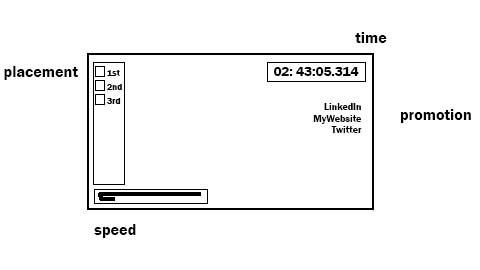
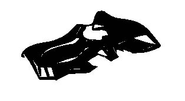

live link: https://www.ians.tech/machblitz

Background

With a bachelor's in Virtual Technologies & Design (read: 3D generalist) and no good barrier between work and life, I plan to make a battle racing game. Building models and materials will take no time. This will be completely about learning to use Three.js api with JavaScript. I will attempt to iterate fast to deliver a game that at least doesn't hurt to look at or play.

You've got the furious must for fast. Choose the speed which dictates the win. Push buttons, Do moves. All oppositers tremble.

Functionality & MVPs

MVPs
- Car responds to player inputs
- Game starts in a time-attack mode
- Displayed timer in HUD
- Displayed final time after crossing finishline

future feature list
- Race starts and you drive
- Steer expertly to stay on the road
- Shove other drivers or get shoved
- Increase or decrease points based on performance
- Rolling terminations will chop off stragglers
- Race finish podium

Wireframes

LinkedIn

MyWebsite

ArtStation

Twitter

Technologies, Libraries, APIs

* three.js
	- JavaScript canvas rendering library
	- https://threejs.org/
	- Ricardo Cabello

* Three.js Webpack ES6 Boilerplate
	- The "Hello World!" for three.js & webpack
	- https://github.com/paulmg/ThreeJS-Webpack-ES6-Boilerplate
	- Paul M G

* Blender
	- Mesh modelling / animation / materials / etc suite
	- https://www.blender.org/
	- Ton Roosendaal

* Substance Painter & Substance Designer
	- Material authoring
	- https://www.substance3d.com/
	- Sébastien Deguy

* Photoshop

* Audition

Implementation Timeline

* Friday Afternoon & Weekend
	- three.js working in browser
	- models & materials can be imported
	- scene global lighting and skybox/skysphere
	- vehicle class associated with model and updates model's position in the scene
	- world block-out // road mesh / vehicle mesh / starting-line w/ banner mesh
* Monday
	- player input influences vehicle movement
	- viewport camera follows vehicle
	- vehicle acceleration
	- vehicle gravity
	- vehicle respects the floor plane
	- vehicle respects the road mesh
* Tuesday
	- race start
	- timer on HUD
	- race end
	- lap system (?)
	- adjust scene meshes, the car moves now so the level should cater to it
	- dummy ai (it just drives forward)
	- race starting positions
	- racer shoving and collision responses
* Wednesday
	- death and respawn (fall off track -> return to track)
	- ai ensmarten (points towards race finish without disrespecting road mesh)
	- points system
	- points on HUD
	- race finish podium
	- add animations to vehicle (wheels turn? jets boost?)
	- add particle effects (dirt trails) (confetti cannons) (race flag waver)
	- add sounds (?)
	- add music (?)
* Thursday Morning
	- safety day / last minute tweaking / upload beans
