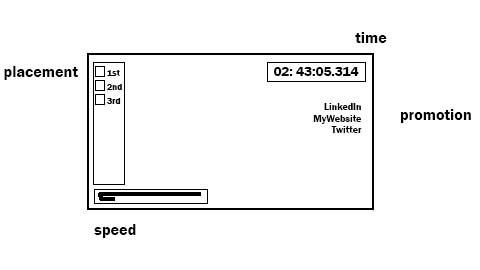

# MachBlitz
## Links
live link: https://www.ians.tech/machblitz

My website: https://www.ians.tech/

LinkedIn: https://www.linkedin.com/in/ianmcgrath-techartist/
# Execution

## Setting up and Testing
```
$ npm i
$ npm run dev
```
## Publishing to gh-pages
```
$ git subtree push --prefix dist origin gh-pages
```

# Background

This is my Three.js break-in project where I'll be leveraging my prior 3D experience to build my favorite kind of racing game and I hope you'll enjoy.


MachBlitz is all about high speeds and tight controls. If you've got an issue with the game, please shoot me a message.

Functionality & MVPs

# MVPs
- Car responds to player inputs
- Game starts in a time-attack mode
- Displayed timer in HUD
- Displayed final time after crossing finishline

# Future Feature List
- AI racers
- Finish race placement
- Inter-car collision
- Car shoving interaction
- Car damage
- Racer retirement
- SFX / VFX
- More race tracks and track selection

# Wireframes




# Technologies, Libraries, APIs

* three.js
	- JavaScript canvas rendering library
	- https://threejs.org/
	- Ricardo Cabello

* Three.js Webpack ES6 Boilerplate
	- The "Hello World!" for three.js & webpack
	- https://github.com/paulmg/ThreeJS-Webpack-ES6-Boilerplate
	- Paul M G

* Blender
	- Mesh modelling / animation / materials / etc suite
	- https://www.blender.org/
	- Ton Roosendaal

* Substance Painter & Substance Designer
	- Material authoring
	- https://www.substance3d.com/
	- Sébastien Deguy

* Photoshop

# Implementation Timeline
- After review, this was a very hopeful development timeline

* Friday Afternoon & Weekend
	- three.js working in browser
	- models & materials can be imported
	- scene global lighting and skybox/skysphere
	- vehicle class associated with model and updates model's position in the scene
	- world block-out // road mesh / vehicle mesh / starting-line w/ banner mesh
* Monday
	- player input influences vehicle movement
	- viewport camera follows vehicle
	- vehicle acceleration
	- vehicle gravity
	- vehicle respects the floor plane
	- vehicle respects the road mesh
* Tuesday
	- race start
	- timer on HUD
	- race end
	- lap system (?)
	- adjust scene meshes, the car moves now so the level should cater to it
	- dummy ai (it just drives forward) <- where I got ahead of myself and had to begin defering work
	- race starting positions
	- racer shoving and collision responses
* Wednesday
	- death and respawn (fall off track -> return to track)
	- ai ensmarten (points towards race finish without disrespecting road mesh)
	- points system
	- points on HUD
	- race finish podium
	- add animations to vehicle (wheels turn? jets boost?)
	- add particle effects (dirt trails) (confetti cannons) (race flag waver)
	- add sounds (?)
	- add music (?)
* Thursday Morning
	- safety day / last minute tweaking / upload beans
